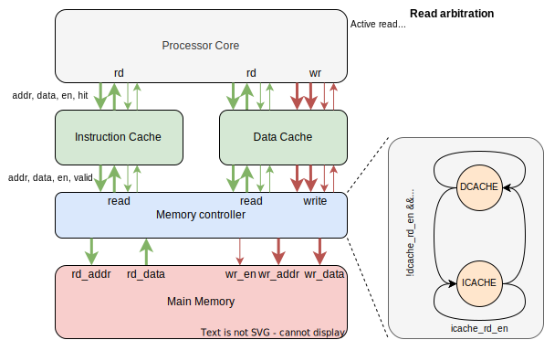

# RISCV Processor Design

This project was done as part of the processor system design course by Prof. Kuruvila Varghese at the Department of Electronic Systems Engineering at the Indian Institute of Science, Bangalore.

### Code

The [RTL subfolder](rtl) has the code for the different blocks in the system implemented on the FPGA

### Reports
[Cache subsystem design report](report_cache.pdf)

[Pipeliend processor core design report](report_pipelined.pdf)

[Multicycle processor design report](report_multicycle.pdf)

